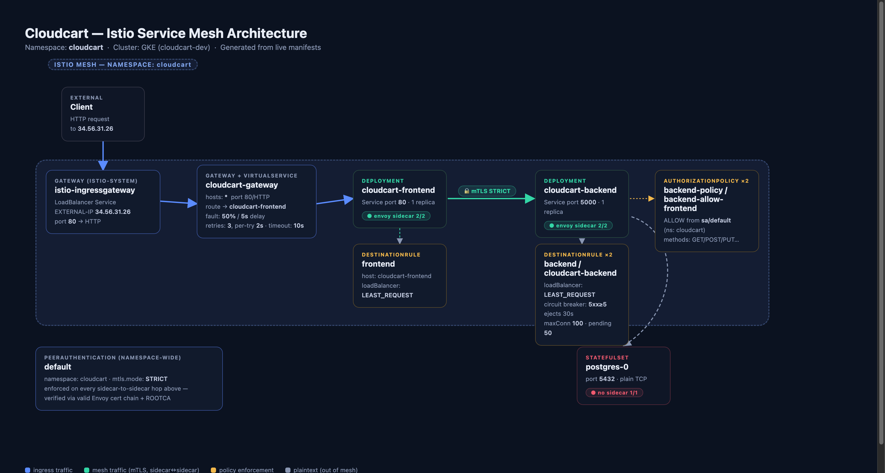

# cloudcart Istio Service Mesh

Istio manifests for the `cloudcart` application, tested live on a GKE cluster
(`cloudcart-dev`). This repo captures the mesh configuration, an architecture
diagram of how the pieces fit together, and validation screenshots proving
each manifest is actually applied and enforced on the cluster.

## Topology

- **Ingress**: `istio-ingressgateway` (LoadBalancer) accepts HTTP on port 80
  and is bound to by `cloudcart-gateway`.
- **Routing**: `VirtualService/cloudcart` routes all traffic to
  `cloudcart-frontend`, with fault injection (50% / 5s delay), 3 retries
  (2s per-try timeout), and a 10s overall timeout.
- **Frontend → Backend**: `cloudcart-frontend` calls `cloudcart-backend` over
  the mesh. Every hop is mTLS **STRICT**, enforced by the namespace-wide
  `PeerAuthentication/default`.
- **Load balancing**: `DestinationRule/frontend` and `DestinationRule/backend`
  both use `LEAST_REQUEST`. `DestinationRule/cloudcart-backend` additionally
  applies circuit breaking (connection pool limits + outlier ejection) to the
  backend.
- **AuthZ**: `AuthorizationPolicy/backend-policy` and
  `/backend-allow-frontend` restrict `cloudcart-backend` to only accept
  requests from `cluster.local/ns/cloudcart/sa/default`.
- **Out of mesh**: `postgres-0` has no Envoy sidecar and is reached over
  plain TCP by the backend — intentionally not part of the mesh.

## Manifests

| File | Kind | Purpose |
|---|---|---|
| [`manifests/gateway.yaml`](manifests/gateway.yaml) | Gateway | Ingress entrypoint, HTTP:80, all hosts |
| [`manifests/virtualservice.yaml`](manifests/virtualservice.yaml) | VirtualService | Routing to frontend + fault injection, retries, timeout |
| [`manifests/destinationrule_frontend.yaml`](manifests/destinationrule_frontend.yaml) | DestinationRule | LEAST_REQUEST load balancing for `cloudcart-frontend` |
| [`manifests/destinationrule_backend.yaml`](manifests/destinationrule_backend.yaml) | DestinationRule | LEAST_REQUEST load balancing for `cloudcart-backend` |
| [`manifests/destinationrule_backend_circuitbreaker.yaml`](manifests/destinationrule_backend_circuitbreaker.yaml) | DestinationRule | Circuit breaker (connection pool + outlier detection) for `cloudcart-backend` |
| [`manifests/authorizationpolicy.yaml`](manifests/authorizationpolicy.yaml) | AuthorizationPolicy | Restricts backend access to the `default` service account |
| [`manifests/authorizationpolicy_backend_allow_frontend.yaml`](manifests/authorizationpolicy_backend_allow_frontend.yaml) | AuthorizationPolicy | ALLOW rule scoped to specific HTTP methods |
| [`manifests/peerauthentication.yaml`](manifests/peerauthentication.yaml) | PeerAuthentication | Namespace-wide STRICT mTLS |

## Validation

Each manifest was validated against the live cluster with `kubectl` and
`istioctl` (`istioctl analyze` reports zero errors), plus a live HTTP request
through the ingress gateway. Screenshots:

| Screenshot | Proves |
|---|---|
| [`validation/00-mesh-overview.png`](validation/00-mesh-overview.png) | Sidecar injection on frontend/backend, `istioctl analyze` clean |
| [`validation/01-gateway.png`](validation/01-gateway.png) | Gateway live, bound to ingressgateway with a real external IP |
| [`validation/02-virtualservice.png`](validation/02-virtualservice.png) | Routing/fault/retry config live, `curl` returns HTTP 200 through the gateway |
| [`validation/03-destinationrules.png`](validation/03-destinationrules.png) | Load balancing + circuit breaker settings live on both workloads |
| [`validation/04-authorizationpolicy.png`](validation/04-authorizationpolicy.png) | RBAC policies applied to the backend pod, principal restricted to `sa/default` |
| [`validation/05-peerauthentication.png`](validation/05-peerauthentication.png) | Effective mTLS mode STRICT, valid Envoy cert chain + root CA issued |

## Notes

- Namespace: `cloudcart`. Cluster: GKE (`cloudcart-dev`).
- The circuit-breaker `DestinationRule` and the second `AuthorizationPolicy`
  were found live on the cluster during validation and added here so the
  repo matches what's actually deployed.
